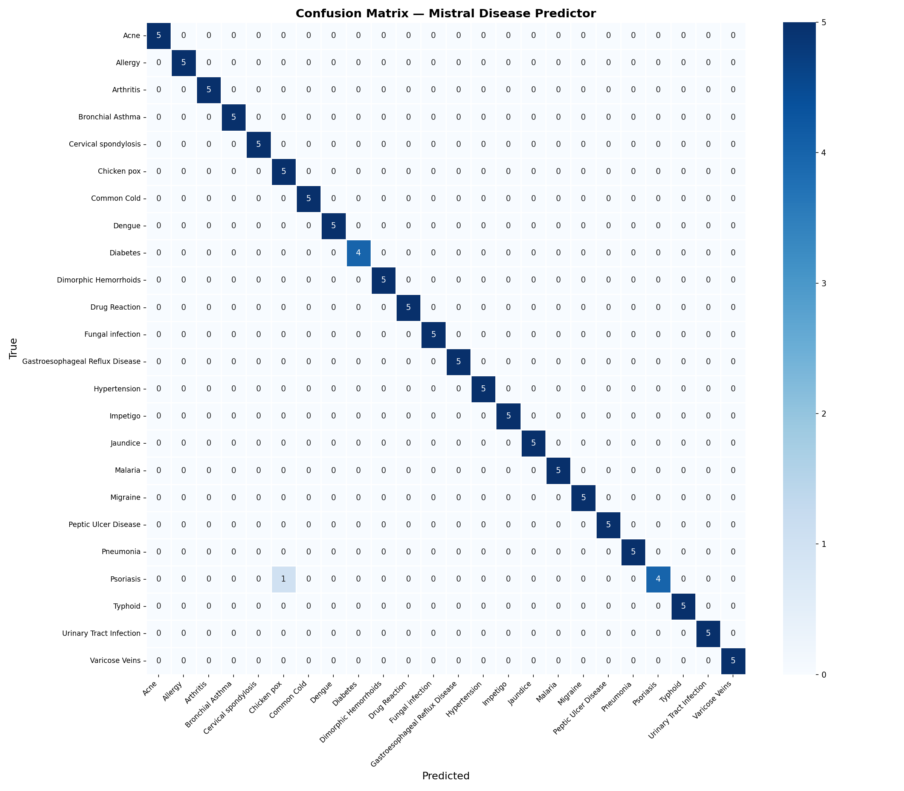
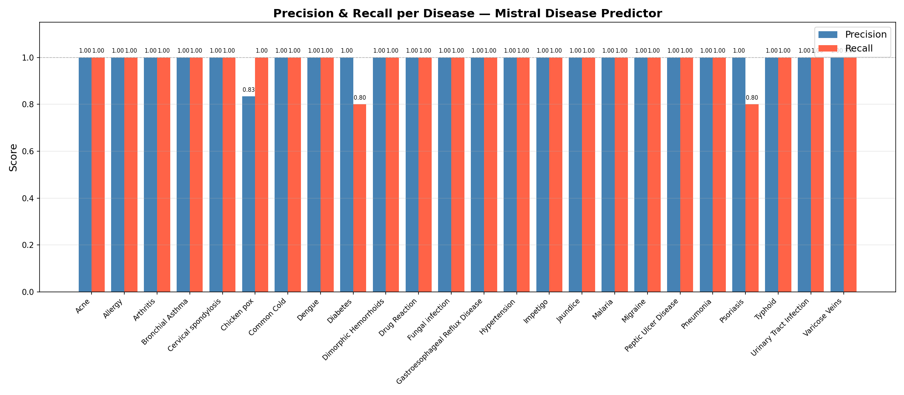

# Symptom-to-Disease Predictor — Fine-tuned Mistral-7B

Fine-tuning of **Mistral-7B-Instruct-v0.3** with **QLoRA (4-bit)** on the Symptom2Disease dataset, achieving **98.33% accuracy** on the test set across 24 diseases.

---

## Results

| Metric | Value |
|--------|-------|
| Test Accuracy | **98.33%** |
| Errors | 2 / 120 |
| Weighted F1 | 0.99 |
| Classes | 24 diseases |

### Confusion Matrix


### Precision & Recall per Disease


---

## Architecture

```
Mistral-7B-Instruct-v0.3 (frozen, 4-bit NF4 quantization)
         └── LoRA adapters
              r=32, alpha=32, dropout=0.05
              Modules: q_proj, k_proj, v_proj, o_proj,
                       gate_proj, up_proj, down_proj
              Trainable parameters: ~42M / 7B total (0.57%)
```

**Training config:**
- Learning rate: `2e-4` with cosine scheduler
- Batch size: 4 x gradient accumulation 2 = effective 8
- Optimizer: paged AdamW 32-bit
- Precision: bfloat16

---

## Dataset

[Symptom2Disease](https://www.kaggle.com/datasets/niyarrbarman/symptom2disease) — 1,200 entries, 24 diseases, perfectly balanced (50 samples per class).

**Prompt format (Mistral Instruct):**
```
<s>[INST] <<SYS>>
You are a medical assistant. Given a description of symptoms,
identify the most likely disease. Answer with only the disease name.
<</SYS>>

Patient symptoms:
{description} [/INST] {disease}</s>
```

---

## Installation

```bash
python -m venv .venv
source .venv/bin/activate      # Linux/Mac
# .venv\Scripts\activate       # Windows

pip install -r requirements.txt
```

**HuggingFace login** (required to download Mistral):
```bash
huggingface-cli login
```
Accept Mistral's terms at: https://huggingface.co/mistralai/Mistral-7B-Instruct-v0.3

**Download base model:**
```bash
python scripts/download_model.py
```

---

## Usage

### 1. Prepare data
Place `Symptom2Disease.csv` at the project root, then:
```bash
python scripts/prepare_data.py
```

### 2. Fine-tune
```bash
$env:PYTHONUTF8="1"             # Windows only
python scripts/train.py
```

### 3. Evaluate
```bash
python scripts/evaluate.py
```
Generates `outputs/evaluation_results.csv`, `outputs/confusion_matrix.png`, and `outputs/precision_recall.png`.

### 4. Inference
```bash
python scripts/infer.py
```
```
Describe symptoms: I have a high fever, severe headache and joint pain.
-> Predicted disease: Dengue
```

---

## Project Structure

```
symptom-disease-llm/
├── Symptom2Disease.csv
├── requirements.txt
├── data/
│   └── label_map.json
├── outputs/
│   ├── mistral-disease-lora/
│   │   └── final/
│   ├── confusion_matrix.png
│   ├── precision_recall.png
│   └── evaluation_results.csv
└── scripts/
    ├── download_model.py
    ├── prepare_data.py
    ├── train.py
    ├── evaluate.py
    └── infer.py
```

---

## Disclaimer

This project is for research purposes only and is not intended for medical use.
